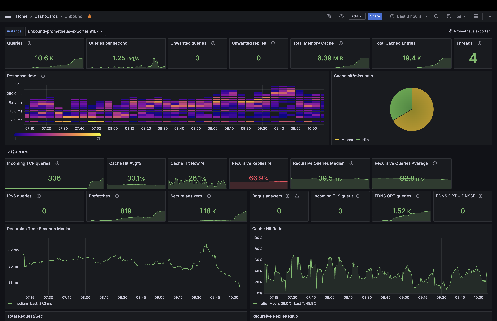

# Docker Unbound Grafana

this repository is a docker version of [Unbound-Config](https://github.com/jianershi/unbound-config)

this build unbound and grafana separately so you have the choice of using other unbound docker. 

## Pre-requisite
1. have a custom docker network `my-network`
    * `docker network create my-network`
2. create a folder /run/unbound for socket file
    *  `mkdir -p /run/unbound`
3. assumes prometheus configure file in `/etc/prometheus`

if you choose to use your own docker unbound container, change the name in `grafana-prometheus-unbound-exporter/docker-compose.yml`
## License
MIT
